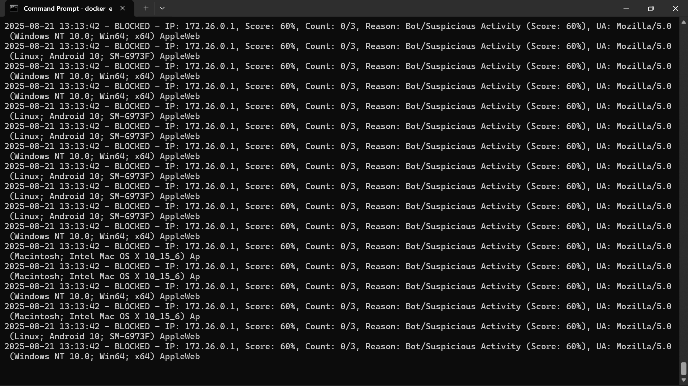
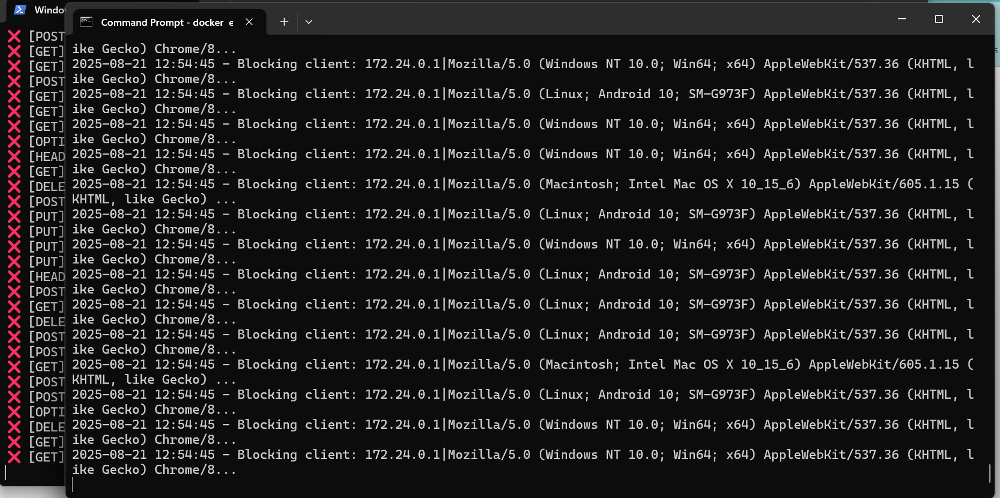
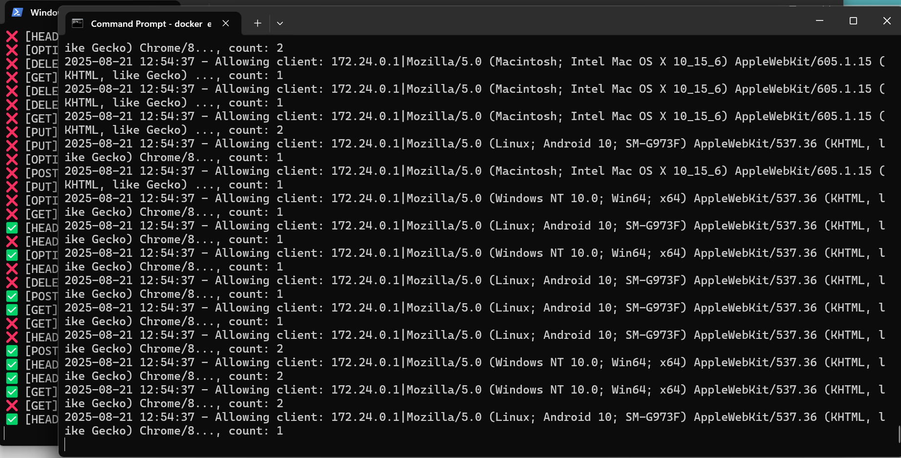

```markdown
# 🌐 Apache2 + PHP 8.2 + Lua (Dockerized)


<div align="center">





</div>

> Sebuah container **Apache2 + PHP 8.2** dengan dukungan **Lua scripting**.  
> Dibuat untuk demonstrasi web server ringan, aman, dan mudah dijalankan hanya dengan Docker.

---

## ✨ Fitur

- ⚡ Apache2 + PHP 8.2
- 🔌 Konfigurasi **Lua hook** (`fingerprint.lua`)
- 📂 Document root di `/var/www/html/public`
- 🛡️ Logging ke `/var/log/apache2/`
- 👤 User default **www-data**
- 📦 Ekstensi PHP populer (`mysqli`, `gd`, `zip`, dll.)

---

## 📂 Struktur Project

```
.
├── Dockerfile
├── fingerprint.lua
├── fingerprint.conf
├── public/
│   └── index.php
```

---

## 🚀 Cara Menjalankan

1. **Build image**
   ```bash
   docker build -t php-apache .
````

2. **Run container**

   ```bash
   docker run -d -p 8080:80 --name webserver php-apache
   ```

3. **Akses web**
   👉 Buka [http://localhost:8080](http://localhost:8080)

---

## 🔧 Konfigurasi Lua

* **fingerprint.conf**

  ```apache
  LuaHookAccessChecker /etc/apache2/lua/fingerprint.lua fingerprint_handler
  ```

* **fingerprint.lua**

  ```lua
  function fingerprint_handler(r)
      r:info("Lua fingerprint handler aktif")
      return apache2.DECLINED
  end
  ```

---

## ⚙️ Konfigurasi Custom Mod Lua (Fingerprint Level)

Contoh konfigurasi custom pada `fingerprint.lua`:

```lua
-- Konfigurasi
local MAX_REQUESTS = 3    -- Maksimal request per kombinasi headers
local BLOCK_TIME = 60     -- Waktu blokir dalam detik
local BOT_THRESHOLD = 70  -- Threshold skor bot (0-100, semakin kecil = semakin mencurigakan)
local STRICT_MODE = true  -- Mode strict untuk bot detection
local LOG_FILE = "/var/log/apache2/lua/apache_antibrute.log"
local DATA_FILE = "/var/log/apache2/lua/apache_antibrute_data.txt"
local SCORE_FILE = "/var/log/apache2/lua/apache_antibrute_scores.txt"
```

Sesuaikan nilai di atas sesuai kebutuhan untuk memperkuat proteksi anti-brute force dan deteksi bot.

## 📸 Preview

Contoh tampilan web ketika mod_lua (fingerprint) berhasil blocked serangan:


---

## 👨‍💻 User

Container berjalan dengan user:

```
www-data
```

---

## 📜 Lisensi

Kode sumber proyek ini dirilis di bawah lisensi MIT.

```text
MIT License

Copyright (c) 2024 [Nama Anda]

Permission is hereby granted, free of charge, to any person obtaining a copy
of this software and associated documentation files (the "Software"), to deal
in the Software without restriction, including without limitation the rights
to use, copy, modify, merge, publish, distribute, sublicense, and/or sell
copies of the Software, and to permit persons to whom the Software is
furnished to do so, subject to the following conditions:

The above copyright notice and this permission notice shall be included in all
copies or substantial portions of the Software.

THE SOFTWARE IS PROVIDED "AS IS", WITHOUT WARRANTY OF ANY KIND, EXPRESS OR
IMPLIED, INCLUDING BUT NOT LIMITED TO THE WARRANTIES OF MERCHANTABILITY,
FITNESS FOR A PARTICULAR PURPOSE AND NONINFRINGEMENT. IN NO EVENT SHALL THE
AUTHORS OR COPYRIGHT HOLDERS BE LIABLE FOR ANY CLAIM, DAMAGES OR OTHER
LIABILITY, WHETHER IN AN ACTION OF CONTRACT, TORT OR OTHERWISE, ARISING FROM,
OUT OF OR IN CONNECTION WITH THE SOFTWARE OR THE USE OR OTHER DEALINGS IN THE
SOFTWARE.
```

⭐ Jangan lupa kasih **star** repo ini kalau bermanfaat!

