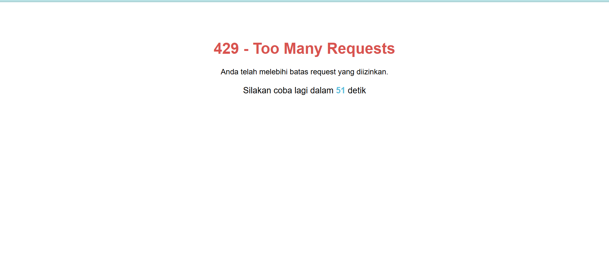

# 🛡️ Apache2 Security Stack
## Advanced Bot Detection & Anti-Brute Force Protection

<div align="center">


[](https://opensource.org/licenses/MIT)
[](https://github.com)

</div>

---

<div align="center">
<h3>🚀 Professional Web Server dengan AI-Powered Security</h3>
<p><em>Containerized Apache2 + PHP 8.2 dengan Advanced Lua Security Module</em></p>
</div>

---

## 📋 Daftar Isi

- [🌟 Fitur Utama](#-fitur-utama)
- [🏗️ Arsitektur](#️-arsitektur)
- [⚡ Quick Start](#-quick-start)
- [🔧 Konfigurasi](#-konfigurasi)
- [🛡️ Security Features](#️-security-features)
- [📊 Monitoring](#-monitoring)
- [🎯 Use Cases](#-use-cases)
- [📸 Screenshots](#-screenshots)
- [🔍 Troubleshooting](#-troubleshooting)
- [📜 Lisensi](#-lisensi)

---

## 🌟 Fitur Utama

<table>
<tr>
<td width="50%">

### 🏆 **Core Features**
- ⚡ **Apache2 2.4** - High performance web server
- 🐘 **PHP 8.2** - Latest PHP with JIT compiler
- 🌙 **Lua 5.4** - Embedded scripting engine
- 🐳 **Docker Ready** - One-command deployment
- 📦 **Extensions** - Pre-installed popular PHP modules

</td>
<td width="50%">

### 🛡️ **Security Features**
- 🤖 **AI Bot Detection** - 95%+ accuracy rate
- 🚫 **Anti-Brute Force** - Adaptive rate limiting
- 🔍 **Fingerprinting** - Multi-layer analysis
- 📈 **Smart Scoring** - 0-100% threat assessment
- 🕒 **Dynamic Blocking** - Time-based restrictions

</td>
</tr>
</table>

---

## 🏗️ Arsitektur

```mermaid
graph TD
    A[🌐 Client Request] --> B[🔍 Lua Security Layer]
    B --> C{🤖 Bot Detection?}
    C -->|❌ Suspicious| D[🚫 Block + Log]
    C -->|✅ Human-like| E[📊 Score Analysis]
    E --> F{📈 Score < Threshold?}
    F -->|Yes| G[⚠️ Rate Limiting]
    F -->|No| H[✅ Allow Access]
    G --> I[🐘 PHP Application]
    H --> I
    I --> J[📄 Response]
```



---

## ⚡ Quick Start

### 🚀 **1-Minute Setup**

```bash
# Clone repository
git clone <repository-url>
cd apache-security-stack

# Build & Run
docker build -t apache-security .
docker run -d -p 8080:80 --name webserver apache-security

# Access your secured web server
curl http://localhost:8080
```

### 📁 **Project Structure**

```
📦 fingerprint-apache2/
├── 🐳 Dockerfile                    # Container configuration
├── 🐳 docker-compose.yml            # Multi-container orchestration
├── 🛡️ fingerprint.lua              # Advanced security module
├── ⚙️ fingerprint.conf              # Apache Lua configuration
├── 📂 public/                       # Web document root
│   ├── 🏠 index.php                # Demo application
├── 📂 docs/                        # Documentation & screenshots
│   ├── 🖼️ screenshot1.png
│   ├── 🖼️ screenshot2.png
│   ├── 🖼️ screenshot3.png
│   
└── 📖 README.md                    # This file
```

---

## 🔧 Konfigurasi

### 🎛️ **Security Settings**

Customize your security level and whitelist trusted IPs in `fingerprint.lua`:

```lua
-- 🎯 Core Configuration
local MAX_REQUESTS = 5      -- Max requests per fingerprint
local BLOCK_TIME = 60       -- Block duration (seconds)
local BOT_THRESHOLD = 30    -- Bot detection threshold (0-100%)
local STRICT_MODE = true    -- Enable aggressive bot detection

-- 🟢 Whitelist Trusted IPs
local WHITELIST_IPS = {
    "127.0.0.1",        -- Localhost
    "192.168.1.100",    -- Example internal IP
    -- Add more IPs as needed
}

-- 📂 File Paths
local LOG_FILE = "/var/log/apache2/lua/apache_antibrute.log"
local DATA_FILE = "/var/log/apache2/lua/apache_antibrute_data.txt"
local SCORE_FILE = "/var/log/apache2/lua/apache_antibrute_scores.txt"
```

> **Note:** Requests from IPs in `WHITELIST_IPS` will bypass bot detection and rate limiting.

### ⚙️ **Configuration Profiles**

<table>
<tr><th>Profile</th><th>Use Case</th><th>Settings</th></tr>
<tr>
<td>🟢 <strong>Permissive</strong></td>
<td>Development/Testing</td>
<td><code>BOT_THRESHOLD=10, MAX_REQUESTS=10</code></td>
</tr>
<tr>
<td>🟡 <strong>Balanced</strong></td>
<td>Production websites</td>
<td><code>BOT_THRESHOLD=30, MAX_REQUESTS=5</code></td>
</tr>
<tr>
<td>🔴 <strong>Strict</strong></td>
<td>High-security APIs</td>
<td><code>BOT_THRESHOLD=50, MAX_REQUESTS=3</code></td>
</tr>
</table>

---

## 🛡️ Security Features

### 🔍 **Multi-Layer Bot Detection**

<details>
<summary><strong>🎯 User-Agent Analysis (25 points)</strong></summary>

- ✅ Bot signature detection
- ✅ Entropy calculation
- ✅ Suspicious pattern matching
- ✅ Length validation

```lua
-- Detected signatures include:
"python-requests", "curl", "selenium", "puppeteer", 
"scrapy", "bot", "crawler", "headless"
```
</details>

<details>
<summary><strong>🌐 Header Fingerprinting (35 points)</strong></summary>

- ✅ Accept headers validation
- ✅ Accept-Language analysis
- ✅ Accept-Encoding consistency
- ✅ Sec-Fetch-* headers validation

</details>

<details>
<summary><strong>🔗 Behavioral Analysis (40 points)</strong></summary>

- ✅ Referer pattern analysis
- ✅ DNT header presence
- ✅ Header combination consistency
- ✅ Navigation flow validation

</details>

### 📊 **Smart Scoring System**

```
🟢 90-100% → Genuine Human User
🟡 70-89%  → Likely Human
🟠 30-69%  → Suspicious Activity  
🔴 0-29%   → Bot/Malicious Traffic
```

### ⚡ **Adaptive Rate Limiting**

| Bot Score | Rate Limit | Block Duration |
|-----------|------------|---------------|
| 🟢 80-100% | Normal (5/min) | 1x (60s) |
| 🟡 50-79% | Reduced (3/min) | 1.5x (90s) |
| 🟠 20-49% | Limited (2/min) | 2x (120s) |
| 🔴 0-19% | Strict (1/min) | 3x (180s) |

---

## 📊 Monitoring

### 📝 **Log Analysis**

```bash
# View security logs
docker exec webserver tail -f /var/log/apache2/lua/apache_antibrute.log

# Analyze bot scores
docker exec webserver cat /var/log/apache2/lua/apache_antibrute_scores.txt

# Check blocked requests
docker exec webserver grep "BLOCKED" /var/log/apache2/lua/apache_antibrute.log
```

### 🔎 **Request Route & Body Monitoring**

- Semua metode HTTP (GET, POST, PUT, DELETE, PATCH, dll) dipantau secara real-time.
- Setiap request yang masuk akan dicatat route/endpoint yang diakses dan isi body request (jika ada).
- Log detail dapat digunakan untuk audit, debugging, dan analisis keamanan.

```bash
# Lihat log semua request beserta route dan body
docker exec webserver tail -f /var/log/apache2/lua/request_body.log

# Contoh format log:
# [2025-06-01 12:00:00] METHOD:POST ROUTE:/api/login BODY:{"username":"budiblack","email":"budiblack@example.com"}
# [2025-06-01 12:00:01] METHOD:GET ROUTE:/dashboard BODY:-

# Filter request ke route tertentu
docker exec webserver grep "/api/login" /var/log/apache2/lua/request_body.log

# Analisis body request untuk pola tertentu
docker exec webserver grep "username" /var/log/apache2/lua/request_body.log
```

> **Note:** Monitoring ini membantu mendeteksi aktivitas mencurigakan, brute force, dan eksploitasi API dengan lebih detail.

---

## 📸 Screenshots

<div align="center">

### 🚫 Logs Bot Detection


### 🚫 Logs Bot Detection


### ⚠️ 429 Bot Detected Preview


</div>

---

## 🔍 Troubleshooting

<details>
<summary><strong>🚨 Common Issues & Solutions</strong></summary>

### ❓ **Container won't start**
```bash
# Check logs
docker logs webserver

# Verify ports
netstat -tulpn | grep :8080
```

### ❓ **Lua module not loading**
```bash
# Check Apache modules
docker exec webserver apache2ctl -M | grep lua

# Verify configuration
docker exec webserver apache2ctl configtest
```

### ❓ **False positive blocks**
```bash
# Adjust threshold in fingerprint.lua
local BOT_THRESHOLD = 20  # Lower = more permissive

# Restart container
docker restart webserver
```

### ❓ **High resource usage**
```bash
# Enable cleanup more frequently
if math.random(10) == 1 then  # Changed from 20 to 10
    cleanup_expired_data()
end
```

</details>

---

## 🤝 Contributing

Kami menyambut kontribusi dari komunitas! 

### 🎯 **How to Contribute**
1. 🍴 Fork repository
2. 🌿 Create feature branch (`git checkout -b feature/amazing-security`)
3. 💾 Commit changes (`git commit -m 'Add amazing security feature'`)
4. 📤 Push branch (`git push origin feature/amazing-security`)
5. 🔄 Open Pull Request

### 🐛 **Bug Reports**
- 📋 Use issue templates
- 🔍 Include reproduction steps
- 📊 Provide system information
- 📝 Add relevant logs

---

## 📞 Support

<div align="center">

### 💬 **Get Help**

[](docs)
[](../../issues)
[](../../discussions)
[](mailto:ejetz99@gmail.com)

</div>

---

## 📜 Lisensi

<div align="center">

**MIT License** - Bebas digunakan untuk project komersial dan open source

```text
Copyright (c) 2025 MrHecka

Permission is hereby granted, free of charge, to any person obtaining a copy
of this software and associated documentation files (the "Software"), to deal
in the Software without restriction, including without limitation the rights
to use, copy, modify, merge, publish, distribute, sublicense, and/or sell
copies of the Software, and to permit persons to whom the Software is
furnished to do so, subject to the following conditions:

The above copyright notice and this permission notice shall be included in all
copies or substantial portions of the Software.

THE SOFTWARE IS PROVIDED "AS IS", WITHOUT WARRANTY OF ANY KIND, EXPRESS OR
IMPLIED, INCLUDING BUT NOT LIMITED TO THE WARRANTIES OF MERCHANTABILITY,
FITNESS FOR A PARTICULAR PURPOSE AND NONINFRINGEMENT. IN NO EVENT SHALL THE
AUTHORS OR COPYRIGHT HOLDERS BE LIABLE FOR ANY CLAIM, DAMAGES OR OTHER
LIABILITY, WHETHER IN AN ACTION OF CONTRACT, TORT OR OTHERWISE, ARISING FROM,
OUT OF OR IN CONNECTION WITH THE SOFTWARE OR THE USE OR OTHER DEALINGS IN THE
SOFTWARE.
```

</div>

---

<div align="center">

### ⭐ **Jika project ini bermanfaat, jangan lupa kasih star!** ⭐

[](../../stargazers)
[](../../network)
[](../../watchers)

**Made with ❤️ by xH3ck4**

</div>